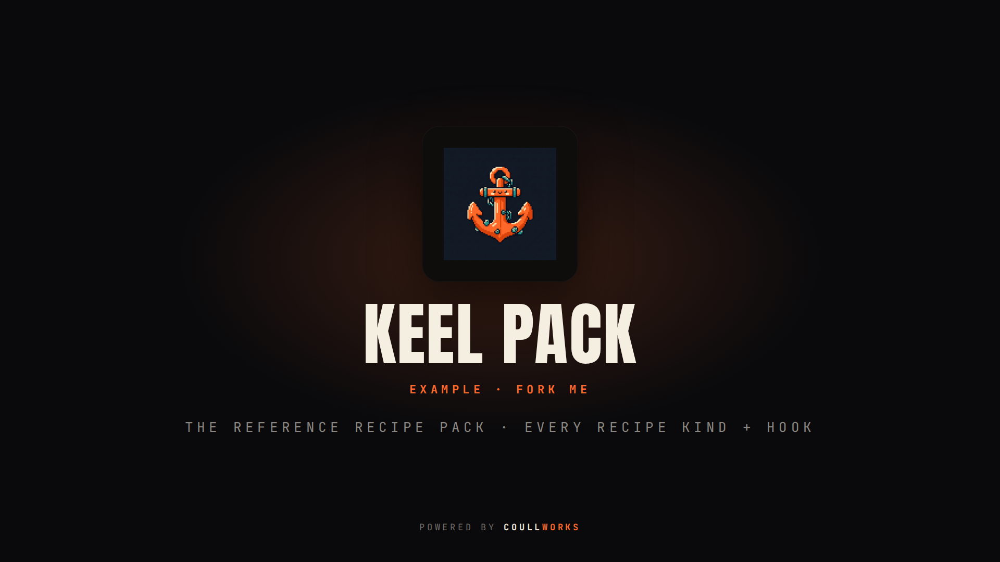

<p align="center">
  
</p>

<h1 align="center">keel-pack-example</h1>

<p align="center">
  <b>The reference keel recipe pack.</b> Every recipe kind + every lifecycle hook, as data. <b>Fork it.</b><br>
  <a href="https://github.com/coullworks/keel">⚓ built for keel</a> · <a href="LICENSE">MIT</a>
</p>

<p align="center">
  <a href="LICENSE"></a>
  <a href="https://github.com/coullworks/keel-pack-example/releases/latest"></a>
  <a href="https://github.com/coullworks/keel-pack-example/actions"></a>
  <a href="https://github.com/coullworks/keel"></a>
</p>

---

This repository is both a working keel **recipe pack** and its specification.
**Fork it.** It is the pack counterpart of
[keel-plugin-example](https://github.com/coullworks/keel-plugin-example): that one
is the template for a **plugin** (code, over keel's subprocess protocol); this one
is the template for a **recipe pack** (data only, no code). It demonstrates
**every recipe kind** and **every lifecycle hook** a pack can carry, so a fork can
see each one and keep the parts it wants.

> **Pack = DATA. Plugin = CODE.**
>
> - A **recipe pack** is git-distributable recipe YAML (+ hook scripts) installed
>   with `keel recipes add`. It ships **no executable** and teaches keel new
>   stacks, services, databases, environments, addons, config wiring and
>   generators. A pack is, in keel's words, a plugin subtype that only injects
>   recipes into the catalog.
> - A **plugin** is an executable keel drives over a subprocess + JSON protocol.
>   It adds behaviour — commands, studio screens/pages/actions, wizard steps,
>   lifecycle listeners — and can *also* ship recipes in a `recipes/` directory.
>
> Reach for a **pack** first: data needs no build and no executable. Reach for a
> **plugin** only when you need real code (UI, network, stored state).

## What's in a pack

```
keel-pack-example/
  keel.pack.yaml               REQUIRED  the manifest — every field documented inline
  recipes/                     REQUIRED  one or more recipe YAML files (the exact built-in schema)
    example-env.yaml           kind: env        a local-dev environment
    example-db.yaml            kind: db         a database (publishes a db.* contract)
    example-config.yaml        kind: config     auto-injected wiring (has a when:)
    example-service.yaml       kind: service    Adminer, a DB UI compose sidecar
    example-addon.yaml         kind: addon      an extra file + the lifecycle-hook demo
    example-generator.yaml     kind: generator  a new thing `keel gen` can create
  hooks/                       optional  script escape-hatch, referenced from a recipe's hooks: block
    pre_build.sh
    post_create.sh
    post_build.sh
  README.md                    REQUIRED
```

A pack recipe is the **same `Recipe` schema** as a built-in — there is no
pack-specific format. A pack is just a namespaced directory of recipes plus a
manifest. keel walks the directory at load time, so every `*.yaml`/`*.yml` except
the manifest is loaded as a recipe.

## The recipe kinds

Recipes resolve and execute in a fixed order: `framework → starter → addon → env
→ db → config → service → frontend → extra → generator`. This pack ships one of
each kind a pack sensibly carries (a framework is a big commitment usually left to
keel's built-ins, but a pack can ship one too):

| File | Kind | What it teaches keel |
|---|---|---|
| `example-env.yaml` | `env` | a local-dev **environment** — declares `env_family` and the command vocabulary (`start`/`exec`/…) every other recipe templates against, so a framework runs under any env |
| `example-db.yaml` | `db` | a **database** — publishes the `db.*` var contract and provisions per env family; splitting "how it comes up" (env) from "how the app wires to it" (framework) lets one db serve every stack |
| `example-config.yaml` | `config` | the **join keel owns** — never user-chosen, *auto-injected* when the plan matches its `when:` (here `uses: sqlite`); patches `.env` to wire the app to whatever database filled the contract |
| `example-service.yaml` | `service` | a **backing service** (Adminer) added as a compose sidecar, opt-in in `keel new`'s Services step |
| `example-addon.yaml` | `addon` | an **additive extra** (an `.editorconfig`) — and the home for the lifecycle-hook demo |
| `example-generator.yaml` | `generator` | a new thing **`keel gen`** / the studio can create, described by **typed inputs** including the `fields` table — one generation shell renders that form for every framework |

Every recipe is minimal but valid and **heavily commented** — read the files
themselves; each explains its kind's specific rules (why a `config` needs a
`when:`, why a `db` splits provisioning from wiring, why a `generator` needs a
`level:`).

## The lifecycle hooks

A recipe's `hooks:` block fires actions at build stages. Each action sets exactly
one of `message:` (print a line), `run:` (a shell command), or `script:` (a path
relative to the pack, run as `sh <path>`). Prefer `message:`/`run:`; use a script
for anything longer. This pack demonstrates all five stages (see
`example-addon.yaml` for four of them and `example-service.yaml` for the fifth):

| Stage | When it fires | Demonstrated in |
|---|---|---|
| `pre_build` | once, before the recipe loop | `example-addon.yaml` (`message` + `hooks/pre_build.sh`) |
| `post_recipe` | after each recipe's files + install | `example-addon.yaml` (`message`) |
| `post_create` | after the **framework** recipe only¹ | `example-service.yaml` (`hooks/post_create.sh`) |
| `post_build` | once, after the whole recipe loop | `example-addon.yaml` (`hooks/post_build.sh`) |
| `post_open` | in the CLI, after `keel open` succeeds | `example-addon.yaml` (`message`) |

¹ **`post_create` fires only for a framework recipe.** keel reads a recipe's
`post_create` block only when its kind is `framework`. This pack ships no
framework, so its `post_create` hook (on the service recipe) will not fire in a
build of this pack — it is wired purely to document the shape for a pack that
*does* ship a framework. The other four stages fire for real from the addon.

Hook scripts receive **no `$KEEL_*` environment variables** — keel renders the
recipe's own `{{tokens}}` (`{{project}}`, `{{env}}`, `{{db.name}}`, …) into the
`run:`/`script:` strings *before* running them, in the project directory. Pass a
value to a script as an argument via `run:`, not via the environment.

## Fork and use it

```sh
# 1. Fork this repo (a pack is one repo).
# 2. Rename it in keel.pack.yaml and the recipe ids; edit/delete the recipes you
#    want. Keep the `# keel-generated` marker on every files: entry (see below).
# 3. Validate it — READ-ONLY, runs no recipe code, no hooks:
keel recipes validate .
#    → ✓ pack example-pack (0.1.0): 6 recipes valid

# 4. Install it from git (fetch + validate only; nothing executes):
keel recipes add https://github.com/coullworks/keel-pack-example

# 5. Its recipes now appear in `keel new` and `keel gen`. They are UNTRUSTED:
#    keel prints the exact commands + hooks and asks before running them.
keel recipes list --packs
```

Or scaffold a fresh pack from this template in one command:

```sh
keel recipes create my-pack        # writes a new pack dir seeded from this template
```

## Trust and provenance

Pack recipes are **untrusted** until you consent, and the pack cannot vouch for
itself — there are **no trust or signature fields in the manifest**. Trust is
decided at *install* time:

- `keel recipes add` only **fetches and validates**; it never runs an `install:`
  step or a hook.
- keel records the pack in `packs.yaml` with `trusted: false`, and stamps every
  recipe with provenance `pack:example-pack`.
- Code (install steps, hooks) runs only during a `keel new`/`keel add` you drive,
  **after keel shows you every command and you approve it**.

That is the download-≠-execute split keel enforces for everything it did not
write itself.

## The `keel-generated` marker

Every file a recipe drops carries a `# keel-generated` (or
`<!-- keel-generated -->`) marker line. It is a convention, not enforced, but it
is what a future `keel update` / `keel recipes remove` uses to refresh or clean
pack-dropped files without clobbering your edits. Keep it on every `files:` entry.

## Support

This example is free and MIT, like keel itself. If it saved you time,
you can sponsor the work at [github.com/sponsors/coullworks](https://github.com/sponsors/coullworks).

## License

[MIT](LICENSE) © CoullWorks

---

<p align="center">
  <a href="https://coullworks.com"><b>⚓ Powered by CoullWorks</b></a><br>
  <sub>Built in the open by <a href="https://coullworks.com">CoullWorks</a> — web &amp; software engineering. <a href="https://coullworks.com">coullworks.com</a></sub>
</p>
